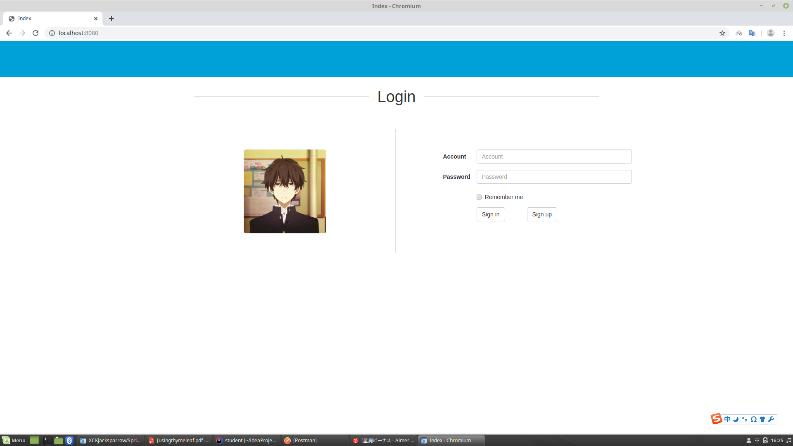
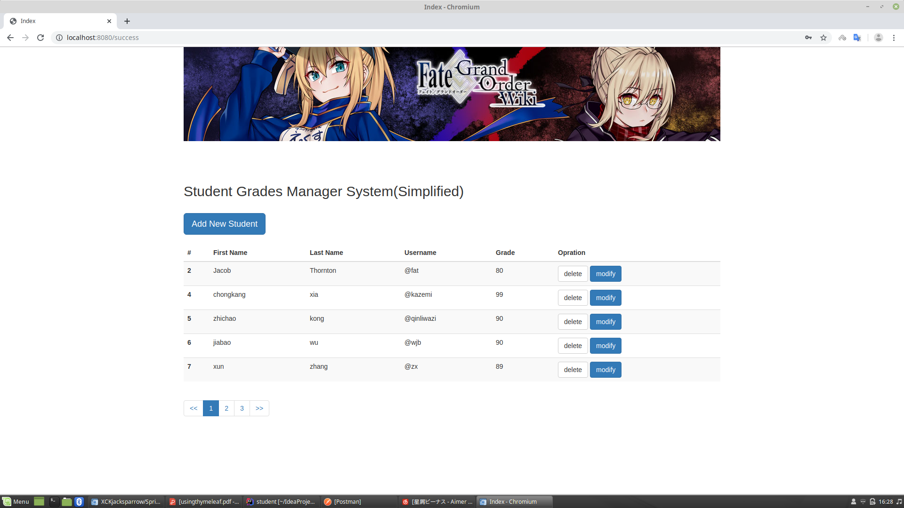
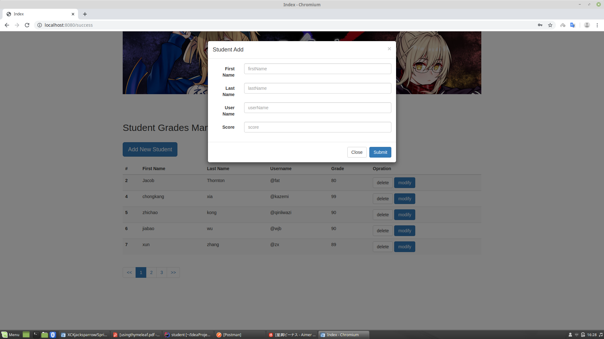

# Student
##学生成绩管理系统
Student是由Springboot2.x + Jpa + Thymeleaf等技术实现的管理网站，如果觉得项目不错，欢迎Star

###适用对象
1.Spring Boot 初学者。该系统综合运用了作者 kazemi.cn 博客中的的文章提及的知识内容，初学者可以阅读文章以及结合该项目学习。
2.懵懂者。初次接触Springboot的人。

###技术栈
####后端
核心框架：SpringBoot
持久层框架：Jpa Mybatis
模板框架：Thymeleaf

####前端
JS框架：Jquery
CSS框架：Bootstrap

###预览效果
####

####安装
下载源码，执行sql文件，然后修改application-dev.yml文件中连接数据库的用户名、密码。运行项目即可。
或者下载jar包 运行 java -jar xxx.jar

sql文件地址：src/resources/test.sql

访问地址：http://localhost:8888

账户：admin
密码：123456

####更新日志
2019-12-12发布第一个版本

2019-12-22整合shiro
已做登录认证
暂未做权限认证